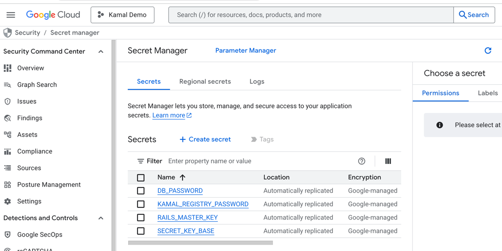

# Terraform Google Cloud with Rails 8 App and Kamal v2

This repository contains a Rails 8 app with Terraform files for deploying the app on Google Cloud. The app uses Kamal v2 for deployment.

## Consulting Help Available
* Would like assistance with using Kamal, Docker, Terraform, or Google Cloud?
* Do you have concerns about the performance, security, and observability of your current deployments?
* Are you interested in optimizing your deployment process to get Heroku features without the high costs?

If so, please [email me](mailto:justin@shakacode.com) or [book a time](https://meetings.hubspot.com/justingordon/30-minute-consultation). 

Check out [ShakaCode's Infrastructure Optimization Services](https://www.shakacode.com/services/it-infrastructure-optimization/). 

### Other Resources 
* [Click to join **React + Rails Slack** to chat with Justin](https://reactrails.slack.com/join/shared_invite/enQtNjY3NTczMjczNzYxLTlmYjdiZmY3MTVlMzU2YWE0OWM0MzNiZDI0MzdkZGFiZTFkYTFkOGVjODBmOWEyYWQ3MzA2NGE1YWJjNmVlMGE).

## Kamal Basics

In order to use [Kamal](https://kamal-deploy.org/), you should try to understand what's going on from first principles.

Kamal is a CLI that uses configuration files to orchestrate commands for Docker deployment on remote machines. See the [Kamal documentation](https://kamal-deploy.org/docs/installation/) for installation and usage details.

Docs are nice. But lots are not in the docs. That's OK for 2 reasons:
1. Kamal gives lots of output to the command line on what's running
2. You have the source code, and you can ask AI for help. 

## Why use Rails 8 with Terraform, Google Cloud, and Kamal v2?

1. **Infrastructure as Code**: Terraform allows you to define your infrastructure in code, making it easier to manage and scale. By using Terraform, you don't have to configure anything in the Google Cloud Console manually.
2. **Consistent Deployments**: With Terraform, you can ensure that your infrastructure is consistent across all environments. This helps in reducing errors and ensuring that your app runs smoothly.
3. Scripts to stand-up and tear-down the infrastructure: The Terraform files in this repository include scripts to create and destroy the infrastructure. This makes it easy to spin up a new environment for testing and tear it down when you're done. Don't pay for resources you're not using!
4. **Kamal v2**: Kamal v2 is a lightweight deployment tool that makes it easy to deploy Rails apps to Google Cloud. It handles the deployment process for you, so you don't have to worry about setting up Kubernetes clusters or managing containers.
5. **Rails 8**: Rails 8 is the latest version of the popular Ruby on Rails framework. It comes with many new features and improvements that make it easier to build web applications.
6. **Google Cloud**: Google Cloud is a powerful cloud platform that offers a wide range of services for building and deploying applications. By using Google Cloud, you can take advantage of its scalability, reliability, and security features.

## Requirements

1. [Google Cloud SDK](https://cloud.google.com/sdk/docs/install) with a gcloud account.
2. [Terraform](https://developer.hashicorp.com/terraform/install).
3. Some domain name where you can add an A record to point to your server's IP address.
3. Docker
4. Ruby 3.4.3

## Setup
1. Clone this repository.
2. Create the Master Key: Run the following command to generate the development and test `master.key` and save it in the correct location:
  ```bash
  echo "94cd5f24badf3102a4c6a09eb4a4a516" > config/master.key
  ```
  Or just make a brand new one for development and test with `rails credentials:edit`.
3. Install the required gems:
   ```bash
   bundle install
   ```
4. Edit the `terraform-gcloud/variables.tf` file with your project details.  You need to create a Google Cloud "project" for this demo.
5. Edit the `config/deploy.yml` file:
   1. Set the `proxy.host` domain name (currently set to `gcp.kamaltutorial.com`)
   2. Change the `registry.username`
   3. Change the `ssh.user` to your username.

See [docs/prerequisites.md](docs/prerequisites.md) for more detailed setup instructions.

See [docs/deploying-changes.md](docs/deploying-changes.md) for step-by-step guides on deploying code changes and infrastructure changes.

See [docs/troubleshooting.md](docs/troubleshooting.md) for debugging deploy issues, SSH failures, and instance recovery.

## Rails 8 Defaults
This Rails 8 example app differs as little as possible from the default Rails 8 app. The main differences are:
1. Terraform setup in the `terraform-gcloud` directory. Terraform is super nice because you can follow the example with minimal work to get your Rails app running on Google Cloud. For a non-tutorial application, you'd put the Terraform files in a separate git repo.
2. The docker and Kamal setup has minimal changes.

## Secrets and Credentials
Note: 
1. I originally created the example to work with 1Password. However, given that a GCP account is required, I decided to use the GCP Secret Manager.
2. To demonstrate best practices for handling secrets, we will NOT use rails credentials for production secrets. Instead, we will use the Google Cloud Secret Manager. Rails credentials are great for non-production environments.

### Google Cloud Secret Manager

1. Open the [Google Cloud Secret Manager](https://console.cloud.google.com/security/secret-manager).
2. Ensure that you have the correct project selected.
3. Click on "Create Secret" to add a new secret.
4. Add the following 3 secrets:
   - `KAMAL_REGISTRY_PASSWORD`: The password for the Docker registry.
   - `DB_PASSWORD`: The password for the database, as you like.
   - `SECRET_KEY_BASE`: Generate with `rails secret`.



### `deploy.yml`
Note that the `deploy.yml` already has:
```yaml
env:
  secret:
    - DB_PASSWORD
    - SECRET_KEY_BASE
```

### `.kamal/secrets`
The `.kamal/secrets` already has this code. Conveniently, you don't need to duplicate your GCP PROJECT_ID.
```
PROJECT_ID=$(cd ./terraform-gcloud && terraform output -raw project_id)
DB_PASSWORD=$(gcloud secrets versions access latest --secret=DB_PASSWORD --project="$PROJECT_ID")
SECRET_KEY_BASE=$(gcloud secrets versions access latest --secret=SECRET_KEY_BASE --project="$PROJECT_ID")
```

### config/database.yml
Note that the `deploy.yml` file ensures that the DB_HOST and DB_PASSWORD are set in the environment. The DB_HOST is set to a seemingly magic value of
```yaml
DB_HOST: 172.18.0.1
```

This is the value that Docker uses to refer to the host machine from within a Docker container. This is because the database is referenced as localhost on the host machine, not localhost in the Docker container. This way, we don't need an IP address for the database. The terraform script sets up the database to work like this by installing `cloud_sql_proxy` and running it.


The `config/database.yml` file already has the following code, which needs to correspond to the secrets and the setup of the databases in `terraform-gcloud/main.tf`:
```yaml
default: &default
   host: <%= ENV.fetch("DB_HOST", "localhost") %>
   password: <%= ENV.fetch("DB_PASSWORD", "password") %>
production:
   primary: &primary_production
      <<: *default
      database: rails_kamal_demo_production
      username: rails_user
   cache:
      <<: *primary_production
      database: rails_kamal_demo_production_cache
      migrations_paths: db/cache_migrate
   queue:
      <<: *primary_production
      database: rails_kamal_demo_production_queue
      migrations_paths: db/queue_migrate
   cable:
      <<: *primary_production
      database: rails_kamal_demo_production_cable
      migrations_paths: db/cable_migrate
```

## Database Setup and Migrations
The database is automatically created and migrated when the Rails app is deployed. This is done via the [bin/docker-entrypoint](bin/docker-entrypoint) script which calls `rails db:prepare`.

Note, the initial deployment will likely fail because the database schema needs to be created — `db:prepare` must create 4 databases (primary, cache, queue, cable) and run all migrations, which can exceed the health check timeout. This is expected. Just run `./bin/kamal deploy` again after the initial setup.

## Scripts

The `terraform-gcloud/bin/` directory contains helper scripts for managing infrastructure:

| Script | Language | Purpose |
|--------|----------|---------|
| `stand-up` | Ruby | Full automated deployment: terraform apply, update deploy.yml IP, DNS verification, kamal setup |
| `tear-down` | Bash | Graceful teardown: kamal app stop, then terraform destroy |
| `cleanup-backups` | Bash | Remove old Terraform state backup files |

The `stand-up` script uses the `DeploymentManager` class in `lib/deployment_manager.rb`, which orchestrates the full deployment flow and provides colored output with timing for each step.

## Automated Deployment
Run `terraform-gcloud/bin/stand-up` to create the infrastructure on Google Cloud and deploy the Rails app using Kamal v2.

This script:

1. Runs `terraform apply` to create the infrastructure (~10 minutes, mostly Cloud SQL provisioning).
2. Updates the `config/deploy.yml` with the new server IP address.
3. Prompts you to update your DNS. **You manage DNS with your own domain registrar** (e.g., GoDaddy, Namecheap, Cloudflare, etc.) — not through Google Cloud. Add or update an `A` record pointing your chosen subdomain (e.g., `gcp.yourdomain.com`) to the IP address shown in the output. The script will poll DNS until it resolves correctly.
   ```text
   Outputs:
   db_primary_name = "rails_kamal_demo_production"
   db_user = "rails_user"
   instance_ip = "34.59.165.111"
   project_id = "kamal-demo-444506"
   ✅ New IP acquired: 34.59.165.111

   === Updating Configuration ===
   Old timeout was set to 120 seconds
   ✅ Updated deploy.yml with new IP and timeout
   ✅ Timeout is now set to 120 seconds

   === Verifying DNS Configuration ===
   Edit DNS for `kamaltutorial.com`: Update or add a DNS Type `A` record, Name: `gcp`, Value: `34.59.165.111`
   Press return to check DNS (or Ctrl-C to exit):
   Checking DNS...
   ✅ DNS verification successful! gcp.kamaltutorial.com → 34.59.165.111
   ```
4. Runs `kamal setup` to build and deploy the Rails app.
5. Visit your domain name in the browser to see your Rails app running on Google Cloud!

## Tear Down

When you're done, run `terraform-gcloud/bin/tear-down` to destroy the infrastructure on Google Cloud (and save any costs!)

The `tear-down` script:
1. Runs `kamal app stop` to stop the Rails app. This is required before destroying infrastructure — Terraform cannot destroy the Cloud SQL database while active connections exist.
2. Runs `terraform destroy` to remove all GCP resources (Compute Engine, Cloud SQL, firewall rules, service accounts).

## Step by Step
To get a sense of the basics of Terraform and Kamal v2, follow these steps manually instead of using the automated scripts. This helps you understand what each command does and see the output from each step.

### Terraform Setup
First, ensure that you can run `terraform` commands to create the infrastructure on Google Cloud.

1. Install the [Google Cloud SDK](https://cloud.google.com/sdk/docs/install) (see [docs/prerequisites.md](docs/prerequisites.md) for platform-specific instructions) and [Terraform](https://developer.hashicorp.com/terraform/install) (via [Homebrew](https://brew.sh/): `brew tap hashicorp/tap && brew install hashicorp/tap/terraform`, or download from the [Terraform downloads page](https://developer.hashicorp.com/terraform/install)).
2. Update the `terraform-gcloud/variables.tf` file with your project details as described above.
3. Run terraform commands from the `terraform-gcloud` directory:
   ```bash
   cd terraform-gcloud
   terraform init     # Initialize Terraform and download providers
   terraform plan     # Preview what will be created
   terraform apply    # Create the infrastructure (type 'yes' to confirm)
   ```
4. `terraform apply` takes about 10 minutes, mainly due to provisioning the Cloud SQL database. Watch the output to see each resource being created. At the end, Terraform prints:
   ```text
   instance_ip = "x.x.x.x"
   project_id = "your-project-id"
   ```
5. You need the IP address for 2 things:
   1. To add an A record to your domain name at your registrar.
   2. To update the `config/deploy.yml` file with the IP address for your server.
6. Run `terraform destroy` to tear down the infrastructure when you're done (after practicing the Kamal deployment).

### Kamal v2 Deployment
Next, deploy the Rails app using Kamal v2. Make sure you've updated `config/deploy.yml` with the new IP and that DNS is pointing to it.

1. Run `./bin/kamal setup` for the first deployment. This builds the Docker image, pushes it to Docker Hub, installs kamal-proxy on the server, and starts the app container. The first run will likely fail on the health check because database setup takes time.
2. Run `./bin/kamal deploy` a second time. Now that the databases exist, the app starts quickly and passes the health check.
3. Visit your domain name in the browser to see your Rails app running on Google Cloud!

### Subsequent Deploys
After the initial setup, subsequent deploys are much faster because Docker layer caching means only changed layers are rebuilt. If you're only changing Rails application code (not Gemfile or system packages), the build reuses cached layers for the base image, system packages, and gem installation — only the `COPY . .` and asset precompilation steps run, which typically takes a few minutes instead of 10+.

```bash
./bin/kamal deploy
```

### Verification Checklist
After deploying, verify the app is working correctly:

```bash
# Check running containers and kamal-proxy status
./bin/kamal details

# Tail the Rails logs (Ctrl-C to stop)
./bin/kamal logs

# Open a Rails console on the server
./bin/kamal console

# Open a bash shell in the container
./bin/kamal shell
```

Then verify in the browser:
1. Visit `https://your-domain.com` — confirm the app loads with SSL (padlock icon)
2. Create, edit, and delete a Post — confirm CRUD works end-to-end
3. Check the footer — should show `rev <sha> · deployed X ago` (production only)
4. Check the browser console — no JavaScript errors

## Troubleshooting
If you encounter any issues during the deployment process, here are some common troubleshooting steps.

### Execution Flow
First, it's important to understand the execution context of when running commands.

1. **Your Local Machine (or CI Machine):**
   * Runs commands like kamal deploy, which connects to the host machine via SSH.
2. **Host Machine:**
   * Receives commands from Kamal and executes them, managing the Docker runtime environment.
   * Temporarily hosts deployment files (e.g., hook scripts) and runs them within Docker containers.
   * `ssh user@host` to get a shell on the host machine.
3. **Docker Machine (Containers):**
   * The host machine runs Docker containers for the Rails app and the Kamal proxy.
   * The app runs here. Commands like bin/rails db:migrate execute inside these containers.
   * `docker ps` to see the running containers.
   * `docker logs CONTAINER_ID` to see the logs of a container.
   * `docker exec -it CONTAINER_ID bash` to get a shell in a container.

### Troubleshooting Steps
1. First, read the console messages very carefully and look for the first error message. This is often the most important clue. If there's a health check timeout, it might be due to the failure to run migrations quickly enough, and then you simply need to run `./bin/kamal deploy` again.
2. Check the logs for the Rails app and the Kamal proxy to see if there are any error messages. You can do this with the command `./bin/kamal logs`.
3. If there is trouble with the database, then you won't get far because your default ENTRYPOINT `bin/docker-entrypoint` will fail. You need to first find the CONTAINER_ID of the failing container. You can do this by:
    1. ssh to the host machine, like `ssh <username>@<ip_address>`.
    2. Run `docker ps` and export a value for CONTAINER_ID. Then you can run `docker logs $CONTAINER_ID` to see the logs.
    3. You can run `docker run -it --entrypoint bash $CONTAINER_ID` to get a shell and then run `bin/docker-entrypoint` to see what's going on. This skips your default ENTRYPOINT.

### Debugging Tips with AI Tools

Next, use AI tools to help you debug. A prompt like this is very helpful. Substitute your host IP address and the Rails container ID. 

```
I'm using Kamal v2. Double check you are not giving me answers for Kamal v1

When you give me commands, tell me which execution context: Local machine, host machine, or docker container.

The remote host IP is 34.122.124.21.

The rails app docker container id is f41ea810b98f
```

To get a good understanding of what's going on, you can run the following commands:
             
```
Walk me through the output, one command at a time for the following output of kamal v2.
Don't analyze everything. Go one command at a time.
Only analyze the "Running" lines, one at a time.

<THEN PASTE COMMAND AND OUTPUT>
```

##  Unaddressed concerns
1. Machine monitoring. 
    * What happens when disk runs out of space?
    *  What happens if memory maxes out?
    *  What happens if CPU maxes out?
    * No Auto-Scaling
2. Machine must have about twice as much memory as new app needs to run with old app during deployment. Why pay for all that extra memory when not needed?
